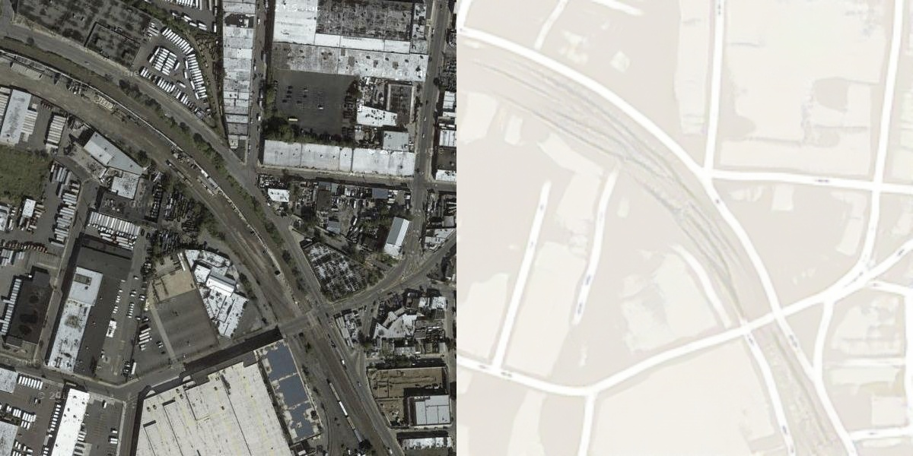

# pix2pix 
## 说明
pytorch复现《Image-to-Image Translation with Conditional Adversarial Networks》
[Arxiv](https://arxiv.org/abs/1611.07004)  
这里大量的代码是拷贝自https://hub.fastgit.org/junyanz/pytorch-CycleGAN-and-pix2pix
。这里用yaml配置工程，同时使用tensorboard展现训练过程
## 使用
以maps数据集为例
```python
python datasetPrepare\donwloadDataset.py --name maps
```
从0开始训练：
```python
python main.py experiments/pix2pix/pix2pix.yaml --stage train
```
从断点训练（比如100）
```python
python main.py experiments/pix2pix/pix2pix.yaml --stage train --which_epoch 100
```
测试：
```python
python main.py experiments/pix2pix/pix2pix.yaml --stage train --which_epoch 205 --imgs examples/maps/inputs
```
实验效果：  




